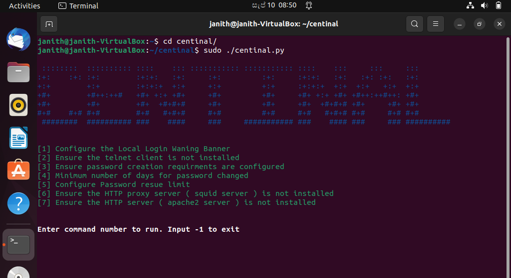

# Centinal
<p align="center"></p>

## About
Centinal is a user-friendly Python script that incorporates five essential security controls from the CSI benchmark into Ubuntu 22.04 LTS, offering a simple and intuitive command line interface to apply these security controls.

## ScreenShots **(REPLACE WITH UPDATED SS)**
<p></p>

## Installation
The following pre-requisites are needed to run the project,
- [Python 3.10 or above (pre installed in Ubuntu 22.04 LTS)](https://www.python.org/)
- [pip3 (Optional)](https://linuxhint.com/install-python-pip-ubuntu-22-04/)


1. Clone Repo
    ```bash
    git clone https://github.com/rajin4463/Centinal.git
    ```

2. Move into directory
    ```bash
    cd Centinal
    ```

3. Install requiremnts __(optinal)__
    ```bash
    pip install -r requirements.txt
    ```

## Run Script
1. Run script as root
    ```bash
    sudo ./centinal.py
    ```
    Enter password if requested.

2. Select Security Controls

    `Enter the control number, eg: 1 to run each control or run them all at once`
    `Enter `-1` to exit the script`